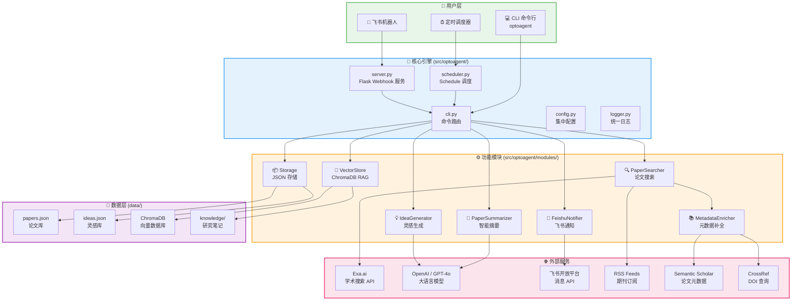
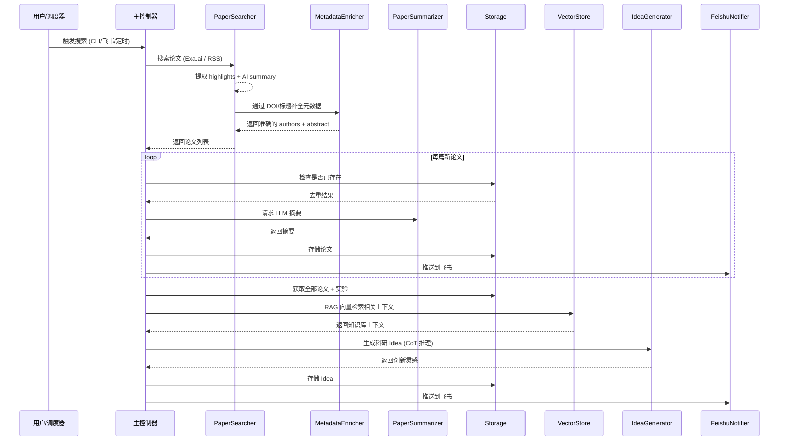

# 🔬 OptoAgent — AI 驱动的光电科研智能助手

<p align="center">
  <strong>自动追踪前沿论文 · LLM 智能摘要 · 科研灵感生成 · 飞书即时通知</strong>
</p>

---

## 📖 项目简介

**OptoAgent** 是一款面向光电/光谱/纳米光子学等领域科研人员的 AI 智能助手。它能够自动追踪 Nature、Science、ACS 等 60+ 顶刊的最新论文，利用大语言模型（LLM）进行论文摘要与科研灵感生成，并通过飞书机器人将结果实时推送给研究团队。

### 🎯 核心价值

| 痛点 | OptoAgent 解决方案 |
|------|-------------------|
| 每天手动刷论文，效率低 | 自动定时搜索 + 智能过滤学术论文（仅最近 30 天） |
| 论文太长，快速了解核心创新困难 | LLM 自动生成结构化摘要 |
| 读完论文后缺乏灵感关联 | 基于 RAG + CoT 推理的科研 Idea 生成 |
| 论文作者/摘要信息不准确 | Semantic Scholar + CrossRef 元数据自动补全 |
| 团队信息同步不及时 | 飞书群聊实时推送 + 交互式指令 |
| 知识分散，实验笔记难以复用 | 本地知识库 + 向量检索（ChromaDB） |

---

## 🏗️ 系统架构

### 整体架构图



### 数据流程图



---

## 📂 项目结构

```
OptoAgent/
├── pyproject.toml              # 📦 包定义 + 依赖 (pip install -e .)
├── config.yaml                 # ⚙️ 集中配置 (搜索/调度/追踪源/期刊)
├── .env.example                # 🔑 API 密钥模板
├── Dockerfile
├── src/
│   └── optoagent/              # Python 可安装包
│       ├── __init__.py
│       ├── cli.py              # 🎮 CLI 入口 → `optoagent <command>`
│       ├── server.py           # 🌐 Flask 飞书 Webhook 服务
│       ├── scheduler.py        # ⏰ 定时调度器
│       ├── config.py           # 📋 配置加载 (yaml + .env)
│       ├── logger.py           # 📝 统一日志系统
│       ├── models.py           # 📦 数据模型 (Paper / Experiment / Idea)
│       └── modules/
│           ├── searcher.py     # 🔍 论文搜索 (Exa.ai + RSS)
│           ├── metadata.py     # 📚 元数据补全 (Semantic Scholar + CrossRef)
│           ├── summarizer.py   # 📝 LLM 论文摘要
│           ├── idea_generator.py # 💡 CoT 推理灵感生成
│           ├── storage.py      # 📦 JSON 数据存储
│           ├── vector_store.py # 🧬 ChromaDB 向量检索 (RAG)
│           └── notifier.py     # 📨 飞书通知 (Webhook + App API)
├── tests/                      # 🧪 pytest 测试套件
├── scripts/                    # 🔧 工具脚本
├── data/
│   ├── papers.json             # 已收录论文数据
│   ├── ideas.json              # 已生成的灵感数据
│   ├── experiments.json        # 实验记录
│   ├── knowledge/              # 研究笔记 (Markdown / PDF)
│   └── chroma_db/              # ChromaDB 向量索引
├── logs/                       # 日志输出
└── docs/
    ├── USER_GUIDE.md           # 📘 用户使用指南
    └── TESTING_GUIDE.md        # 🧪 功能测试方案
```

---

## ⚙️ 核心模块说明

### 🔍 PaperSearcher — 论文搜索引擎

- **主动搜索**：通过 [Exa.ai](https://exa.ai) 搜索学术论文，支持限定 15 个高影响力学术域名 (Nature, Science, arXiv, IEEE, Optica 等)
- **智能内容提取**：使用 Exa `highlights` + `summary` 获取干净的论文内容（非原始网页 HTML）
- **时间窗口过滤**：仅返回最近 N 天（默认 30 天）发表的论文，通过 `startPublishedDate` 参数精确控制
- **源监控**：监控 `config.yaml` 中配置的 9 大出版商（Nature Portfolio, Science Family, Wiley, ACS, Optica, APS, AIP, RSC, Elsevier）
- **RSS 订阅**：支持 RSS Feed 方式追踪特定期刊更新
- **降级模式**：未配置 API Key 时自动切换为模拟数据

### 📚 MetadataEnricher — 元数据补全 *(新增)*

通过 Semantic Scholar 和 CrossRef 免费 API，自动补全 Exa 搜索结果中缺失的 **作者** 和 **摘要** 信息。

- **DOI 自动提取**：从论文 URL 中智能识别 DOI（支持 nature.com, science.org, wiley, acs.org 等）
- **多源查询链**：Semantic Scholar (DOI) → CrossRef (DOI) → Semantic Scholar (标题搜索) → Exa 原始数据
- **标题模糊匹配**：处理截断或格式化的标题，确保高匹配率
- **免费无需额外 API Key**

### 📝 PaperSummarizer — 智能摘要

- 调用 OpenAI GPT-4o（支持自定义 `OPENAI_BASE_URL` 接入其他 LLM）
- 有摘要时 → 提取核心创新与结果
- 无摘要时 → 基于标题推断研究主题
- 摘要控制在 200 词以内，精炼实用

### 💡 IdeaGenerator — 科研灵感生成

- **Chain-of-Thought (CoT) 推理**：系统识别趋势 → 发现空白 → 关联实验 → 提出方案 → 评估可行性
- **RAG 增强**：结合本地知识库（ChromaDB）中的研究笔记和实验记录，生成更贴合团队方向的创意
- **结构化输出**：每个 Idea 包含标题、描述、推理过程、来源论文

### 📦 Storage — JSON 数据存储

- **结构化存储**：Paper / Experiment / Idea 三类数据持久化为 JSON
- **去重机制**：论文按标题自动去重（不区分大小写）
- **中文支持**：`ensure_ascii=False` 确保中文正确存储

### 🧬 VectorStore — 向量检索 (RAG)

- 使用 ChromaDB + `all-MiniLM-L6-v2` 嵌入模型
- 对本地 Markdown / TXT / PDF 笔记进行索引和语义检索
- **多编码支持**：自动检测文件编码（UTF-8 / UTF-16 / GBK / Latin-1），避免 BOM 等编码问题导致崩溃
- 支持 `data/knowledge/` 目录下的 `.md`、`.txt`、`.pdf` 文件

### 📨 FeishuNotifier — 飞书通知

- **双通道发送**：优先使用飞书 App API（支持指定群聊/用户），降级为 Webhook
- **Token 管理**：自动获取和缓存 `tenant_access_token`，到期前自动刷新
- **富文本通知**：论文通知 📄 包含标题、作者、链接、摘要；灵感通知 💡 包含标题、描述、推理过程
- **错误检测**：Webhook 发送后检查响应状态，失败时记录详细错误日志

---

## 🚀 快速开始

```bash
# 安装
git clone https://github.com/Zyleiver/OptoAgent.git && cd OptoAgent
python -m venv .venv && .venv\Scripts\activate
pip install -e ".[dev]"

# 配置密钥
cp .env.example .env   # 编辑 .env 填入 API Key

# 使用
optoagent active_search --query "miniaturized spectrometer"
optoagent run_cycle --query "2D material optoelectronics"
optoagent monitor_sources
optoagent list_papers
optoagent list_ideas
optoagent index_knowledge
optoagent add_experiment --title "实验名" --desc "描述" --results "结果"
```

> 详细使用请参阅 [用户指南](docs/USER_GUIDE.md) | 功能测试请参阅 [测试方案](docs/TESTING_GUIDE.md)

---

## 🔧 技术栈

| 类别 | 技术 |
|------|------|
| 语言 | Python 3.9+ |
| 包管理 | pyproject.toml (PEP 621) |
| Web 框架 | Flask |
| 搜索引擎 | Exa.ai API |
| 元数据补全 | Semantic Scholar API + CrossRef API |
| LLM | OpenAI GPT-4o（支持自定义 Base URL） |
| 向量数据库 | ChromaDB + SentenceTransformers |
| 即时通讯 | 飞书开放平台 (Webhook + App API) |
| 配置管理 | YAML + python-dotenv |
| 日志 | Python logging |
| 定时调度 | schedule |
| 测试 | pytest |
| 容器化 | Docker |

---

## 🎯 追踪覆盖范围

OptoAgent 目前追踪以下 **9 大出版商**、**60+ 顶级期刊**：

| 出版商 | 代表期刊 |
|--------|---------|
| Nature Portfolio | Nature, Nature Photonics, Nature Materials, Nature Nanotechnology |
| Science Family | Science, Science Advances, Science Robotics |
| Wiley | Advanced Materials, Advanced Energy Materials, Laser & Photonics Reviews |
| ACS | Nano Letters, ACS Nano, JACS, ACS Photonics |
| Optica (OSA) | Optica, Optics Letters, Optics Express |
| APS | Physical Review Letters, Physical Review X |
| AIP | Applied Physics Reviews, APL Photonics |
| RSC | Chemical Society Reviews, Nanoscale, Journal of Materials Chemistry |
| Elsevier | Nano Energy, Materials Today, Applied Materials Today |

---

## 🗺️ 路线图

### v1.1（当前版本）
- ✅ Exa.ai 学术论文搜索 + 智能内容提取 (highlights + summary)
- ✅ LLM 论文摘要 + CoT 科研灵感生成
- ✅ 本地知识库 RAG 增强 (ChromaDB)
- ✅ Semantic Scholar / CrossRef 元数据自动补全
- ✅ 飞书双通道通知 + 交互式机器人
- ✅ 定时调度器 + Docker 部署支持

### v2.0（规划中）
- 🔲 迁移到 LangChain / LangGraph Agent 架构
- 🔲 多轮对话式论文分析
- 🔲 实验记录自动关联论文
- 🔲 Web Dashboard 可视化面板
- 🔲 多用户/多方向支持

---

## 📄 License

MIT License
