# 🔬 OptoAgent — AI 驱动的光电科研智能助手

<p align="center">
  <strong>自动追踪前沿论文 · LLM 智能摘要 · 科研灵感生成 · 飞书即时通知</strong>
</p>

---

## 📖 项目简介

**OptoAgent** 是一款面向光电/光谱/纳米光子学等领域科研人员的 AI 智能助手。它能够自动追踪 Nature、Science、ACS 等 60+ 顶刊的最新论文，利用大语言模型（LLM）进行论文摘要与科研灵感生成，并通过飞书机器人将结果实时推送给研究团队。

### 🎯 核心价值

| 痛点 | OptoAgent 解决方案 |
|------|-------------------|
| 每天手动刷论文，效率低 | 自动定时搜索 + 智能过滤学术论文 |
| 论文太长，快速了解核心创新困难 | LLM 自动生成结构化摘要 |
| 读完论文后缺乏灵感关联 | 基于 RAG + CoT 推理的科研 Idea 生成 |
| 团队信息同步不及时 | 飞书群聊实时推送 + 交互式指令 |
| 知识分散，实验笔记难以复用 | 本地知识库 + 向量检索（ChromaDB） |

---

## 🏗️ 系统架构

### 整体架构图

```mermaid
graph TB
    subgraph UserLayer["👤 用户层"]
        CLI["💻 CLI 命令行<br/>optoagent"]
        Feishu["💬 飞书机器人"]
        Scheduler["⏰ 定时调度器"]
    end

    subgraph CoreEngine["🧠 核心引擎 (src/optoagent/)"]
        Main["cli.py<br/>命令路由"]
        Server["server.py<br/>Flask Webhook 服务"]
        SchedModule["scheduler.py<br/>Schedule 调度"]
        Config["config.py<br/>集中配置"]
        Logger["logger.py<br/>统一日志"]
    end

    subgraph Modules["⚙️ 功能模块 (src/optoagent/modules/)"]
        Searcher["🔍 PaperSearcher<br/>论文搜索"]
        Summarizer["📝 PaperSummarizer<br/>智能摘要"]
        IdeaGen["💡 IdeaGenerator<br/>灵感生成"]
        StorageMod["📦 Storage<br/>JSON 存储"]
        VectorMod["🧬 VectorStore<br/>ChromaDB RAG"]
        Notifier["📨 FeishuNotifier<br/>飞书通知"]
    end

    subgraph ExternalAPIs["🌐 外部服务"]
        Exa["Exa.ai<br/>学术搜索 API"]
        LLM["OpenAI / GPT-4o<br/>大语言模型"]
        FeishuAPI["飞书开放平台<br/>消息 API"]
        RSS["RSS Feeds<br/>期刊订阅"]
    end

    subgraph DataLayer["💾 数据层 (data/)"]
        Papers["papers.json<br/>论文库"]
        Ideas["ideas.json<br/>灵感库"]
        ChromaDB["ChromaDB<br/>向量数据库"]
        KnowledgeDir["knowledge/<br/>研究笔记"]
    end

    CLI --> Main
    Feishu --> Server
    Scheduler --> SchedModule
    SchedModule --> Main
    Server --> Main

    Main --> Searcher
    Main --> Summarizer
    Main --> IdeaGen
    Main --> StorageMod
    Main --> VectorMod
    Main --> Notifier

    Searcher --> Exa
    Searcher --> RSS
    Summarizer --> LLM
    IdeaGen --> LLM
    Notifier --> FeishuAPI

    StorageMod --> Papers
    StorageMod --> Ideas
    VectorMod --> ChromaDB
    VectorMod --> KnowledgeDir

    style UserLayer fill:#e8f5e9,stroke:#4caf50,stroke-width:2px
    style CoreEngine fill:#e3f2fd,stroke:#2196f3,stroke-width:2px
    style Modules fill:#fff3e0,stroke:#ff9800,stroke-width:2px
    style ExternalAPIs fill:#fce4ec,stroke:#e91e63,stroke-width:2px
    style DataLayer fill:#f3e5f5,stroke:#9c27b0,stroke-width:2px
```



### 数据流程图

```mermaid
sequenceDiagram
    participant U as 用户/调度器
    participant M as 主控制器
    participant S as PaperSearcher
    participant SM as PaperSummarizer
    participant ST as Storage
    participant VS as VectorStore
    participant IG as IdeaGenerator
    participant N as FeishuNotifier

    U->>M: 触发搜索 (CLI/飞书/定时)
    M->>S: 搜索论文 (Exa.ai / RSS)
    S-->>M: 返回论文列表

    loop 每篇新论文
        M->>ST: 检查是否已存在
        ST-->>M: 去重结果
        M->>SM: 请求 LLM 摘要
        SM-->>M: 返回摘要
        M->>ST: 存储论文
        M->>N: 推送到飞书
    end

    M->>ST: 获取全部论文 + 实验
    M->>VS: RAG 向量检索相关上下文
    VS-->>M: 返回知识库上下文
    M->>IG: 生成科研 Idea (CoT 推理)
    IG-->>M: 返回创新灵感
    M->>ST: 存储 Idea
    M->>N: 推送到飞书
```



---

## 📂 项目结构

```
OptoAgent/
├── pyproject.toml              # 📦 包定义 + 依赖 (pip install -e .)
├── config.yaml                 # ⚙️ 集中配置 (搜索/调度/追踪源/期刊)
├── .env.example                # 🔑 API 密钥模板
├── Dockerfile
├── src/
│   └── optoagent/              # Python 可安装包
│       ├── __init__.py
│       ├── cli.py              # 🎮 CLI 入口 → `optoagent <command>`
│       ├── server.py           # 🌐 Flask 飞书 Webhook 服务
│       ├── scheduler.py        # ⏰ 定时调度器
│       ├── config.py           # 📋 配置加载 (yaml + .env)
│       ├── logger.py           # 📝 统一日志系统
│       ├── models.py           # 📦 数据模型 (Paper / Experiment / Idea)
│       └── modules/
│           ├── searcher.py     # 🔍 论文搜索 (Exa.ai + RSS)
│           ├── summarizer.py   # 📝 LLM 论文摘要
│           ├── idea_generator.py # 💡 CoT 推理灵感生成
│           ├── storage.py      # 📦 JSON 数据存储
│           ├── vector_store.py # 🧬 ChromaDB 向量检索 (RAG)
│           └── notifier.py     # 📨 飞书通知 (Webhook + App API)
├── tests/                      # 🧪 pytest 测试套件
├── scripts/                    # 🔧 工具脚本
├── data/
│   ├── papers.json             # 已收录论文数据
│   ├── ideas.json              # 已生成的灵感数据
│   ├── knowledge/              # 研究笔记 (Markdown / PDF)
│   └── chroma_db/              # ChromaDB 向量索引
├── logs/                       # 日志输出
└── docs/
    └── USER_GUIDE.md
```

---

## ⚙️ 核心模块说明

### 🔍 PaperSearcher — 论文搜索引擎

- **主动搜索**：通过 [Exa.ai](https://exa.ai) 搜索学术论文，支持限定 15 个高影响力学术域名 (Nature, Science, arXiv, IEEE, Optica 等)
- **源监控**：监控 `config.yaml` 中配置的 9 大出版商（Nature Portfolio, Science Family, Wiley, ACS, Optica, APS, AIP, RSC, Elsevier）
- **RSS 订阅**：支持 RSS Feed 方式追踪特定期刊更新
- **降级模式**：未配置 API Key 时自动切换为模拟数据

### 📝 PaperSummarizer — 智能摘要

- 调用 OpenAI GPT-4o（支持自定义 `OPENAI_BASE_URL` 接入其他 LLM）
- 有摘要时 → 提取核心创新与结果
- 无摘要时 → 基于标题推断研究主题
- 摘要控制在 200 词以内，精炼实用

### 💡 IdeaGenerator — 科研灵感生成

- **Chain-of-Thought (CoT) 推理**：系统识别趋势 → 发现空白 → 关联实验 → 提出方案 → 评估可行性
- **RAG 增强**：结合本地知识库（ChromaDB）中的研究笔记和实验记录，生成更贴合团队方向的创意
- **结构化输出**：每个 Idea 包含标题、描述、推理过程、来源论文

### 📦 Storage — JSON 数据存储

- **结构化存储**：Paper / Experiment / Idea 三类数据持久化为 JSON
- **去重机制**：论文按标题自动去重（不区分大小写）

### 🧬 VectorStore — 向量检索 (RAG)

- 使用 ChromaDB + `all-MiniLM-L6-v2` 嵌入模型
- 对本地 Markdown / PDF 笔记进行索引和语义检索
- 支持 `data/knowledge/` 目录下的 `.md`、`.txt`、`.pdf` 文件

### 📨 FeishuNotifier — 飞书通知

- **双通道发送**：优先使用飞书 App API（支持指定群聊/用户），降级为 Webhook
- **Token 管理**：自动获取和缓存 `tenant_access_token`，到期前自动刷新
- **富文本通知**：论文通知 📄 包含标题、作者、链接、摘要；灵感通知 💡 包含标题、描述、推理过程

---

## 🚀 快速开始

```bash
# 安装
git clone https://github.com/your-org/OptoAgent.git && cd OptoAgent
python -m venv .venv && .venv\Scripts\activate
pip install -e ".[dev]"

# 配置密钥
cp .env.example .env   # 编辑 .env 填入 API Key

# 使用
optoagent active_search --query "miniaturized spectrometer"
optoagent run_cycle --query "2D material optoelectronics"
optoagent monitor_sources
optoagent list_papers
optoagent list_ideas
```

> 详细使用请参阅 [用户指南](docs/USER_GUIDE.md)

---

## 🔧 技术栈

| 类别 | 技术 |
|------|------|
| 语言 | Python 3.9+ |
| 包管理 | pyproject.toml (PEP 621) |
| Web 框架 | Flask |
| 搜索引擎 | Exa.ai API |
| LLM | OpenAI GPT-4o（支持自定义 Base URL） |
| 向量数据库 | ChromaDB + SentenceTransformers |
| 即时通讯 | 飞书开放平台 (Webhook + App API) |
| 配置管理 | YAML + python-dotenv |
| 日志 | Python logging |
| 定时调度 | schedule |
| 测试 | pytest |
| 容器化 | Docker |

---

## 🎯 追踪覆盖范围

OptoAgent 目前追踪以下 **9 大出版商**、**60+ 顶级期刊**：

| 出版商 | 代表期刊 |
|--------|---------|
| Nature Portfolio | Nature, Nature Photonics, Nature Materials, Nature Nanotechnology |
| Science Family | Science, Science Advances, Science Robotics |
| Wiley | Advanced Materials, Advanced Energy Materials, Laser & Photonics Reviews |
| ACS | Nano Letters, ACS Nano, JACS, ACS Photonics |
| Optica (OSA) | Optica, Optics Letters, Optics Express |
| APS | Physical Review Letters, Physical Review X |
| AIP | Applied Physics Reviews, APL Photonics |
| RSC | Chemical Society Reviews, Nanoscale, Journal of Materials Chemistry |
| Elsevier | Nano Energy, Materials Today, Applied Materials Today |

